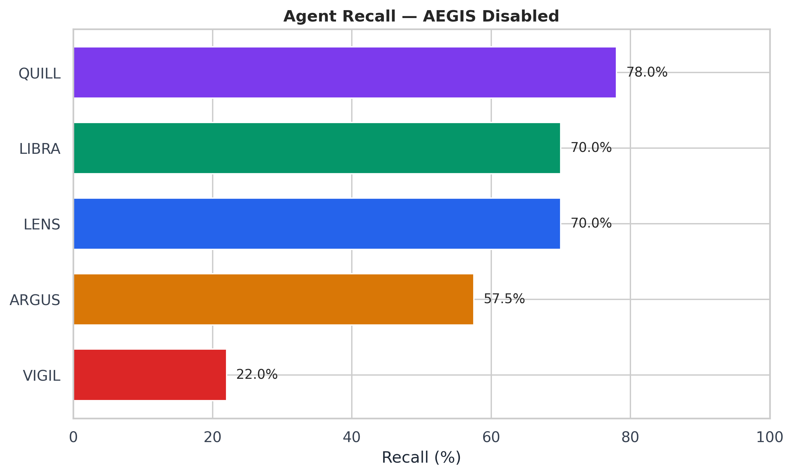
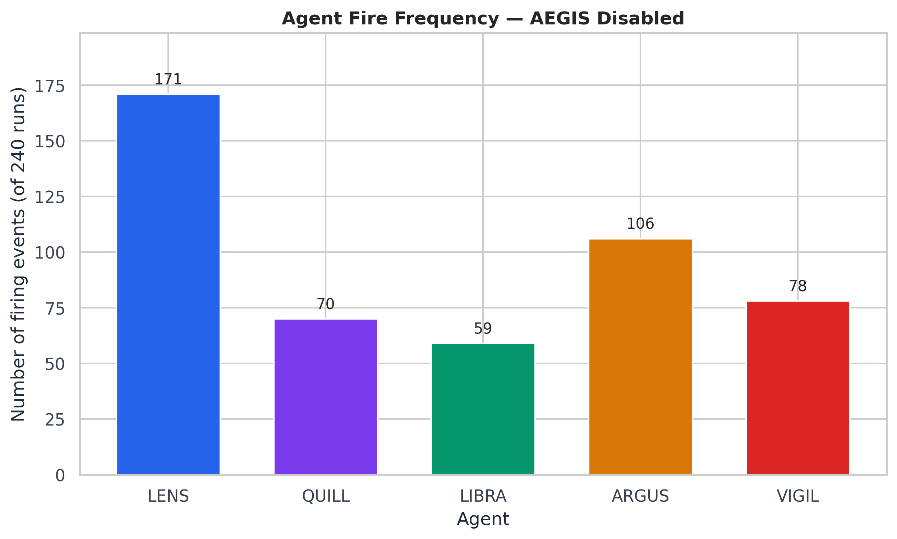
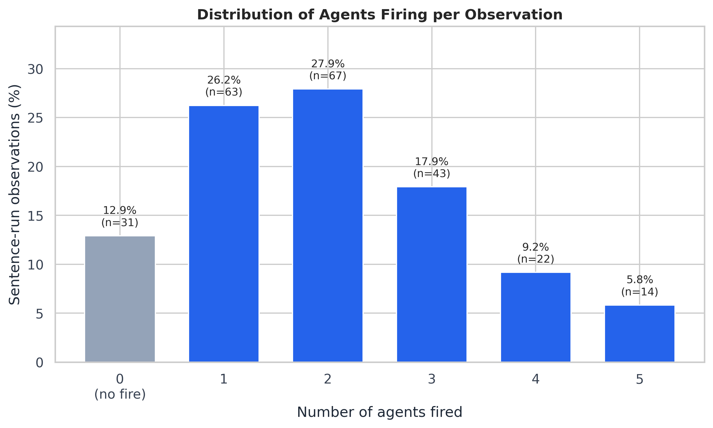
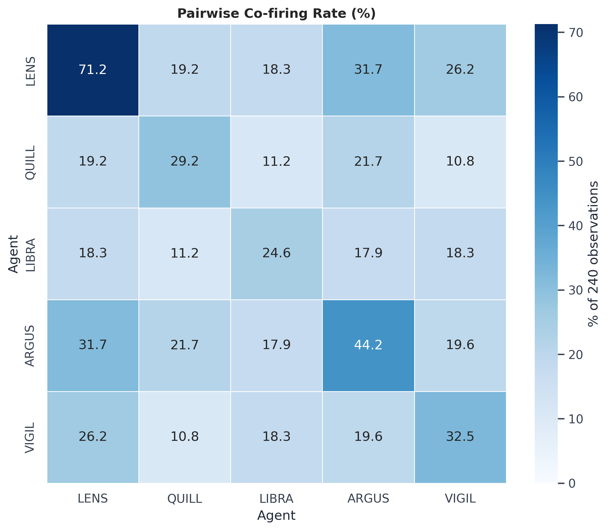
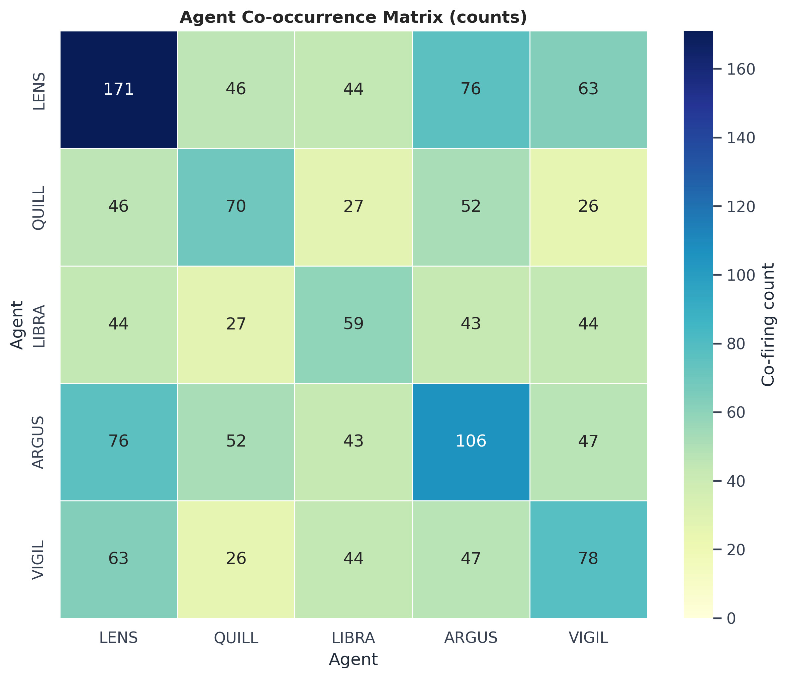
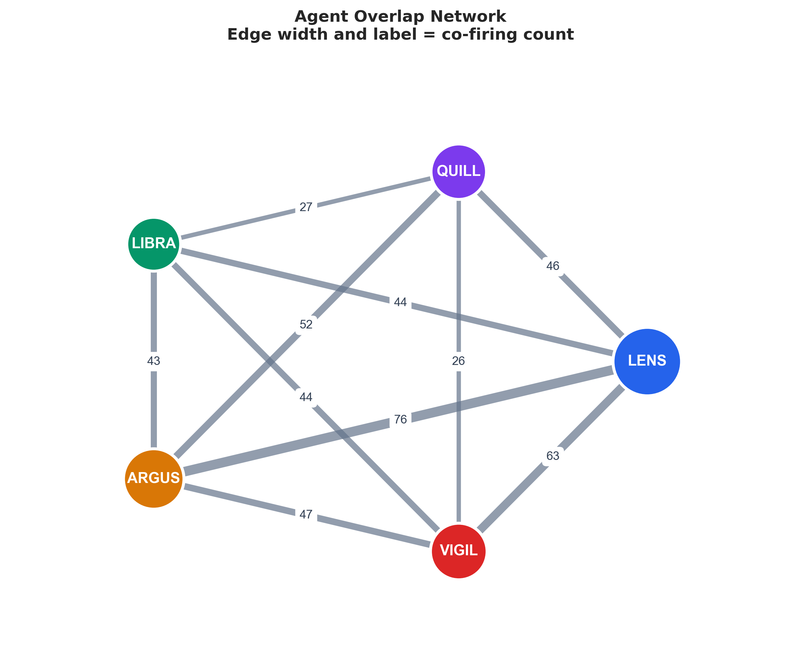
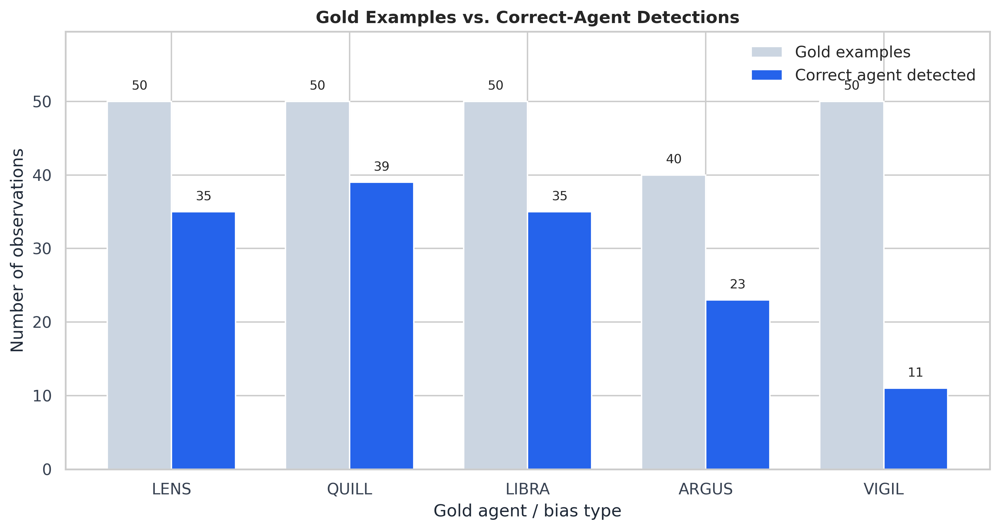

# Agents-only Evaluation (AEGIS Disabled)

## Objective

This experiment evaluates the five individual bias specialists independently of AEGIS. AEGIS is completely disabled: every specialist is run directly, every agent is allowed to fire, and multiple agents may fire on the same observation. A prediction is successful when the gold bias's specialist is present in the fired-agent set. This is therefore an **agent recall / coverage** experiment, not a final attribution-accuracy experiment.

Overlapping detections are expected here and are **not errors**. They measure the candidate set that would be available to AEGIS in a later conflict-resolution stage.

## Executive Summary

Source: `eval/output/aegis_ablation_per_run.csv` (the preserved Stage 1 artifact). The source contains **48 unique sentences**, each evaluated across **5 runs**, for **240 sentence-run observations**. Unless stated otherwise, all counts and percentages below use those 240 observations—the same unit used by the original ablation summary.

- Overall agent recall (coverage): **59.6%** (143/240)
- Mean agents fired per observation: **2.02**
- Median agents fired per observation: **2**
- Maximum agents fired: **5**
- At least 2 agents firing: **60.8%** (146/240)
- At least 3 agents firing: **32.9%** (79/240)

| Agents fired | Observations | Percentage |
|---:|---:|---:|
| 0 (no agents fired) | 31 | 12.9% |
| 1 | 63 | 26.2% |
| 2 | 67 | 27.9% |
| 3 | 43 | 17.9% |
| 4 | 22 | 9.2% |
| 5 | 14 | 5.8% |

## Per-agent Performance

`Fire Count` counts all firings by an agent, including off-target firings. The table is sorted by recall.

| Agent | Bias type | Recall | True positives | Misses | Fire count |
|---|---|---:|---:|---:|---:|
| QUILL | `framing_effect` | 78.0% | 39 | 11 | 70 |
| LENS | `overgeneralisation` | 70.0% | 35 | 15 | 171 |
| LIBRA | `certainty_inflation` | 70.0% | 35 | 15 | 59 |
| ARGUS | `confirmation_bias` | 57.5% | 23 | 17 | 106 |
| VIGIL | `causal_inference_error` | 22.0% | 11 | 39 | 78 |

## Overlap Analysis

The mean number of agents firing is **2.02** per observation. Multi-agent firing is common: **60.8%** of observations have two or more agents, and **32.9%** have three or more. The distribution above includes the 31 observations (12.9%) where no agent fired so the percentages sum to 100%.

Pairwise overlap is the number of the 240 observations in which both agents fired; it is not restricted to the gold bias.

| Pair | Overlap count | Overlap percentage |
|---|---:|---:|
| LENS + ARGUS | 76 | 31.7% |
| LENS + VIGIL | 63 | 26.2% |
| QUILL + ARGUS | 52 | 21.7% |
| ARGUS + VIGIL | 47 | 19.6% |
| LENS + QUILL | 46 | 19.2% |
| LENS + LIBRA | 44 | 18.3% |
| LIBRA + VIGIL | 44 | 18.3% |
| LIBRA + ARGUS | 43 | 17.9% |
| QUILL + LIBRA | 27 | 11.2% |
| QUILL + VIGIL | 26 | 10.8% |

## Confusion / Co-occurrence Matrix

This is a symmetric co-firing matrix. Diagonal cells are each agent's total fire count; off-diagonal cells are pairwise co-firing counts.

| Row / column | LENS | QUILL | LIBRA | ARGUS | VIGIL |
|---|---|---|---|---|---|
| LENS | 171 | 46 | 44 | 76 | 63 |
| QUILL | 46 | 70 | 27 | 52 | 26 |
| LIBRA | 44 | 27 | 59 | 43 | 44 |
| ARGUS | 76 | 52 | 43 | 106 | 47 |
| VIGIL | 63 | 26 | 44 | 47 | 78 |

## Miss Analysis

The gold label is the expected specialist's canonical bias type. A miss means that specialist was absent from the fired-agent set in that observation.

| Gold bias type (agent) | Total examples | Detected | Missed | Recall |
|---|---:|---:|---:|---:|
| `framing_effect` (QUILL) | 50 | 39 | 11 | 78.0% |
| `overgeneralisation` (LENS) | 50 | 35 | 15 | 70.0% |
| `certainty_inflation` (LIBRA) | 50 | 35 | 15 | 70.0% |
| `confirmation_bias` (ARGUS) | 40 | 23 | 17 | 57.5% |
| `causal_inference_error` (VIGIL) | 50 | 11 | 39 | 22.0% |

## Graphs

## Interpretation

The specialists demonstrate partial but uneven coverage: the correct agent appears in **143/240** observations (59.6%). QUILL has the strongest recall (78.0%), LIBRA and LENS reach 70.0%, ARGUS reaches 57.5%, and VIGIL is the clear weak point at 22.0%. The Stage 1 misses—**97 observations**—occur before AEGIS is involved, so the correct specialist is not available as a direct candidate in those cases.

Overlap is common rather than exceptional. The most frequent pair is **ARGUS + LENS** (76/240, 31.7%), followed by **LENS + VIGIL** (63/240, 26.2%). In **109 observations** (45.4% of all observations; 76.2% of coverage hits), the correct agent fired alongside at least one other agent. These are the cases where AEGIS has the correct specialist available but must resolve competing candidates.

Stage 1 alone cannot quantify how much *final attribution* loss is caused by AEGIS conflict resolution; it contains no post-AEGIS labels. It does establish that **97 of 240** observations have an upstream coverage failure that AEGIS cannot resolve by selecting the correct specialist from the existing fired set. The evidence therefore supports prioritizing improvements to individual-agent coverage—especially VIGIL, then ARGUS—while also improving AEGIS for the substantial multi-agent subset where the correct candidate is present.

## Deliverables

- `agent_summary.csv` — per-agent recall, counts, and fire frequency
- `pairwise_overlap.csv` — all agent pairs, sorted by overlap count
- `sentence_level_results.csv` — the 240 original sentence-run observations; `run` is retained because fired-agent lists vary across repeats
- `01_agent_recall.png` through `07_gold_vs_detected.png` — publication-quality figures
